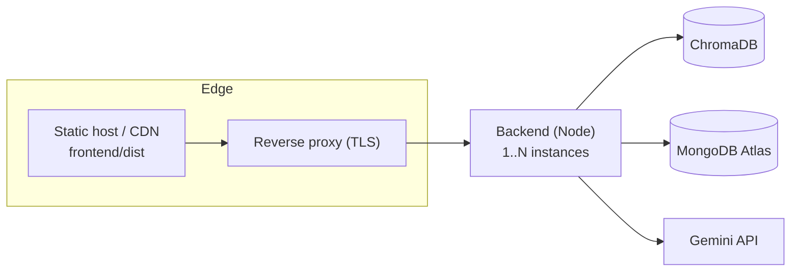

# Deployment Guide — INDUS-BRAIN AI

For local setup see [SETUP.md](SETUP.md). This guide covers running the stack for
demos and deploying to production.

## 1. Prerequisites

- Node.js ≥ 20, npm ≥ 10
- MongoDB Atlas connection string (or a reachable MongoDB)
- Gemini API key
- ChromaDB — **either** Docker **or** the Python package (no Docker required)

## 2. Environment

Copy and fill the env files:

```bash
cp backend/.env.example backend/.env
cp frontend/.env.example frontend/.env
```

Key backend variables (full list in `backend/.env.example`):

| Variable | Purpose |
|----------|---------|
| `NODE_ENV` | `development` / `production` / `test` (test disables rate limiting) |
| `PORT` | API port (default 4000) |
| `MONGODB_URI` | MongoDB Atlas connection string |
| `GEMINI_API_KEY` | Gemini API key (server fails fast if missing) |
| `CHROMA_URL` | ChromaDB URL (default `http://localhost:8000`) |
| `CORS_ORIGIN` | Comma-separated allow-list of frontend origins |
| `GEMINI_MODEL` / `GEMINI_EMBEDDING_MODEL` | `gemini-2.5-flash` / `gemini-embedding-001` |
| `RAG_*`, `RCA_*`, `COMPLIANCE_*`, `LESSONS_*`, `OCR_*`, `KG_*` | Per-feature tuning (sane defaults) |

> **Security:** never commit `.env`. Set real secrets via your platform's secret
> manager. Rotate any credential that has been shared in plaintext.

## 3. Start ChromaDB

**Option A — Docker (recommended):**
```bash
npm run docker:up        # brings up ChromaDB (and optional local Mongo)
curl http://localhost:8000/api/v2/heartbeat   # expect 200
```

**Option B — Python (no Docker):**
```bash
pip install chromadb
python -c "from chromadb.cli.cli import app; app()" run --path ./.chroma-data --port 8000
```

## 4. Run

**Development:**
```bash
npm install
npm run dev              # backend :4000 + frontend :5173
```

**Production build:**
```bash
npm run build           # typecheck + build both workspaces
npm run start           # serve the built backend (:4000)
```
Serve the built frontend (`frontend/dist`) from any static host/CDN, or behind the
same reverse proxy as the API.

## 5. Production hardening checklist

- [x] `helmet` security headers, CORS allow-list, request compression — enabled.
- [x] **Rate limiting** — broad (200/min) + tighter AI tier (30/min). Tune in `middleware/rateLimit.ts`.
- [x] Centralized error handling; stack traces never leaked in `production`.
- [x] Validated file uploads (MIME whitelist, size cap, randomized filenames).
- [x] Graceful shutdown (SIGTERM/SIGINT): closes server, disconnects Mongo, terminates the OCR worker.
- [x] `createdAt` index for the documents list; `contentText` excluded from list reads.
- [ ] **Add authentication/authorization** before exposing the API publicly (currently open).
- [ ] Consider a **background job queue** for ingestion at high upload volume.
- [ ] Put the API behind TLS + a reverse proxy (nginx/Caddy); set `trust proxy` if behind a load balancer so rate-limit keys use the real client IP.

## 6. Recommended topologies



- **Frontend:** Vercel/Netlify/S3+CloudFront (static `dist`).
- **Backend:** Render/Railway/Fly.io/ECS container, or a VM with a process manager.
- **ChromaDB:** managed Chroma Cloud, or a persistent container with a mounted volume.
- **MongoDB:** Atlas (managed).

## 7. Health & smoke test

```bash
curl http://<host>:4000/api/health
# { "status": "ok", "service": "indus-brain-ai", "mongodb": "connected", ... }

npm run -w backend test:e2e   # if wired; or: node backend/tests/e2e.mjs
```

## 8. Operational notes

- **Gemini free tier** caps generation requests/day; the AI endpoints degrade to
  HTTP 503 when quota is exhausted (no fabricated output). Use a paid key for sustained demos.
- ChromaDB must be running for indexing and retrieval; if it's down, uploads still
  succeed but documents stay `indexed=false` until re-indexed (`POST /api/documents/:id/reindex`).
