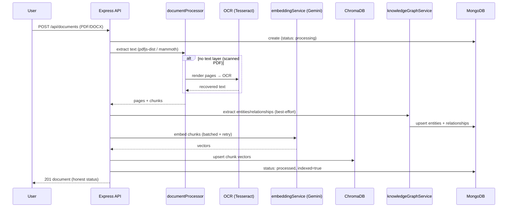
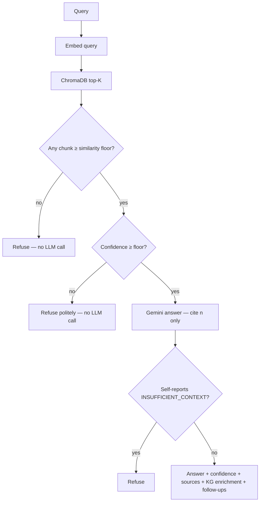
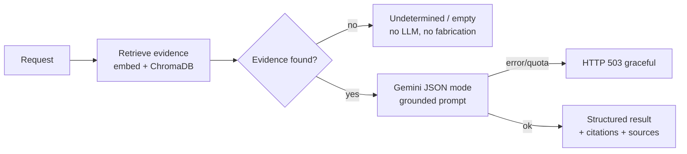
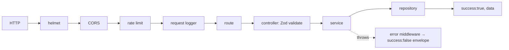

# Project Flow — INDUS-BRAIN AI

End-to-end flows for the main journeys. All AI flows are grounded: answers are
built only from retrieved evidence and cite their sources.

## 1. Ingestion pipeline (upload)

Extraction/chunking always succeed locally; embedding+indexing degrade gracefully
(document is stored `processed`/`indexed=false`). Status is `processed` **only**
after a successful vector upsert. KG extraction never blocks indexing.

## 2. Grounded RAG (Knowledge Assistant)

## 3. AI agents (RCA · Compliance · Lessons summary)

- **RCA**: retrieves across maintenance/incident/inspection/manual → root cause, evidence, recommended actions, preventive maintenance, confidence.
- **Compliance**: SOP text + regulation excerpts → per-requirement met/partial/missing, conflicts, deterministic score, recommendations.
- **Lessons**: deterministic dashboard (Mongo aggregations) + grounded AI summary of recurring failures / frequent problems / lessons.

## 4. Request lifecycle (every endpoint)

